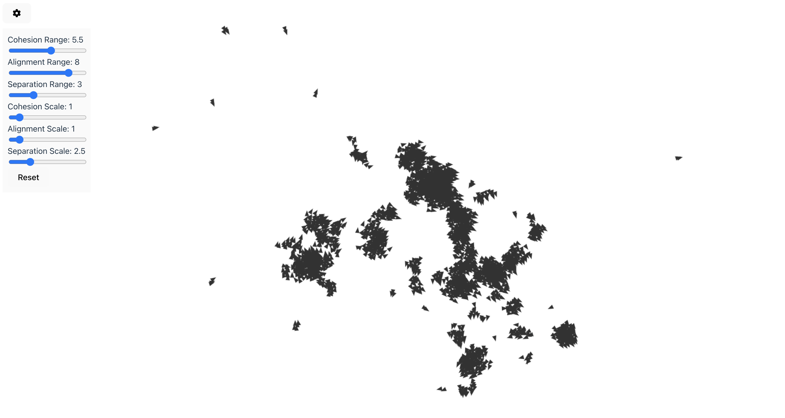
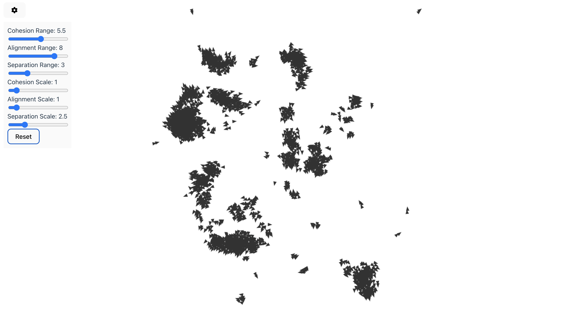

# flock-simulation
Boids simulation

## Frontend

React + Vite

Run with `npm run dev`

## Backend

Spring Boot with Kotlin

Kotlin coroutines used for optimising the simulation. Simulation runs fine with 3000 boids 20 FPS on a laptop. The algorithm complexity increases exponentially with the amount of boids.

Rquires Java 17

Run with `./gradlew bootRun`

