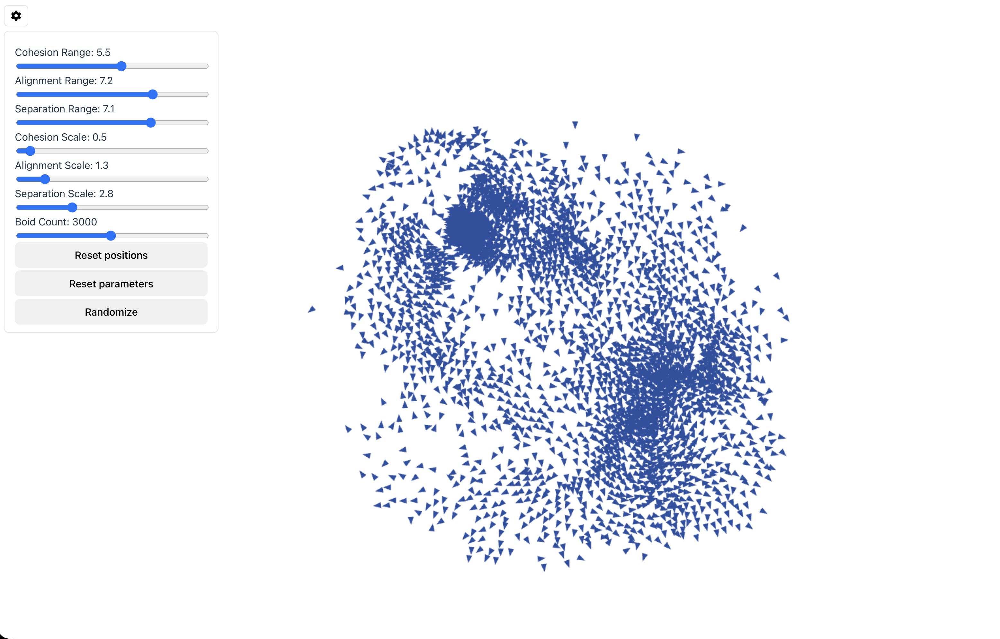
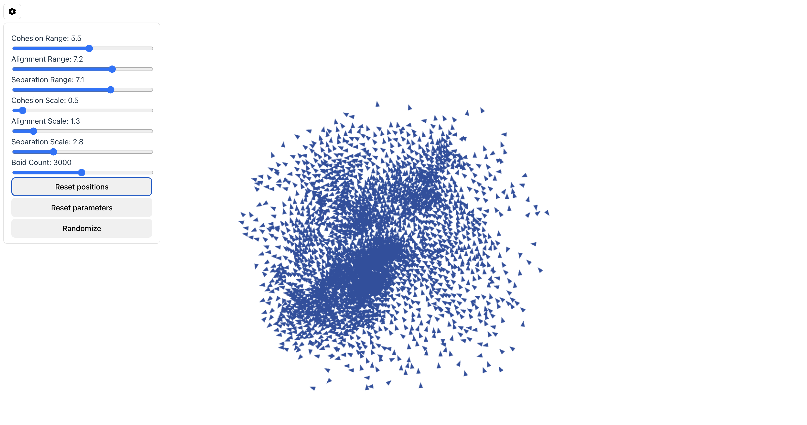
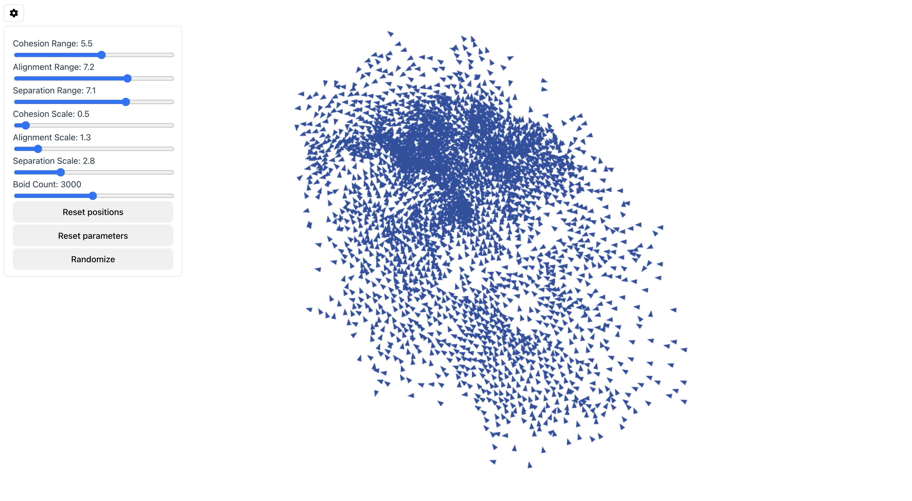

# flock-simulation

A real-time boids simulation. https://en.wikipedia.org/wiki/Boids

Parameters (separation, alignment, and cohesion) can be tuned (or randomized) on the fly, also the boid amount.

## Frontend

React 19, Vite, HTML5 Canvas

## Backend

Kotlin, Spring Boot, Kotlin coroutines, WebSocket (STOMP)

Kotlin coroutines used for optimising the simulation. Simulation runs fine with 3000 boids ~35 FPS on a laptop. The basic algorithm complexity increases exponentially with the amount of boids.
Spatial grid partitioning used for efficient neighbour lookups to achieve roughly O(n) complexity.

## Requirements

Java 23
Node.js 18+

## Running locally

Start backend:

```bash
cd backend
./gradlew bootRun
```

Start frontend:
```bash
cd frontend
npm install
npm run dev
```

Open [http://localhost:5173](http://localhost:5173). The frontend connects to the backend via WebSocket on port 8080.

## Screenshots






